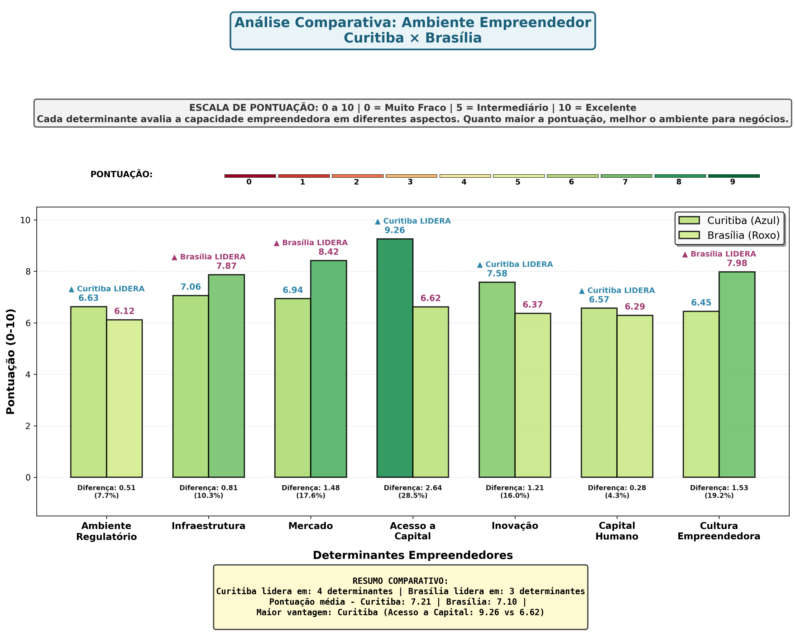

# Atividade 1 (UAM) - Seleção de Cidade-Base para Vertiporto Conceitual

**Disciplina:** Mobilidade Aérea Urbana — IT-214  
**Instituto:** Instituto Tecnológico de Aeronáutica (ITA)  
**Grupo:** 
- Jaqueline Rodrigues
- Luiz Tozi
- Tariq Lopes Sousa — Graduando em Engenharia Civil Aeronáutica • [LinkedIn](https://www.linkedin.com/in/tariq-lopes-sousa-avila-da-silva-cardoso-b2b436186/)
- Gabriel Rufino  

---

## Apresentação do Trabalho

Este trabalho organiza uma análise comparativa para selecionar a cidade-base em que será desenvolvido um vertiporto conceitual ao final da disciplina de **Mobilidade Aérea Urbana (UAM)**. A comparação foi estruturada entre **Brasília (DF)** e **Curitiba (PR)**, com uso de indicadores públicos e critérios orientados à viabilidade inicial de implantação de UAM.

---

## Contextualização

A viabilização de UAM com aeronaves eVTOL depende menos de "ter a aeronave" e mais de construir condições sistêmicas: infraestrutura, mercado, ambiente institucional, capacidade de inovação e integração urbana. Por isso, a escolha da cidade-base para um vertiporto conceitual deve ser sustentada por um método transparente, baseado em evidências, que explicite trade-offs e o racional de decisão.

---

## Finalidade do Projeto

Estabelecer um roteiro estruturado de decisão para justificar, com dados e critérios, por que **Brasília foi selecionada** como a cidade em que o vertiporto conceitual será desenvolvido, utilizando Curitiba como cidade de contraste (benchmark) para reforçar a análise comparativa.

---

## Fronteiras do Estudo

A análise está delimitada à seleção de cidade-base para fins acadêmicos (projeto conceitual), contemplando:

- perfil urbano e socioeconômico (escala, densidade, área e proxies de demanda);
- desempenho do ecossistema empreendedor (pilares do ICE 2023);
- elementos institucionais pertinentes à articulação regulatória/aeronáutica (em nível conceitual);
- justificativa final da escolha (critérios e trade-offs).

**Fora do escopo** desta etapa: dimensionamento arquitetônico completo do vertiporto, simulações de rotas, análise ambiental detalhada ou estudo de viabilidade econômico-financeira aprofundado.

---

## Sequência Metodológica

### 1. Definição do Problema de Decisão

**Pergunta-guia:** qual cidade oferece melhores condições iniciais para sustentar, conceitualmente, um vertiporto UAM, considerando ecossistema, demanda potencial e articulação institucional?

### 2. Seleção das Alternativas Comparáveis

Definir **Brasília (DF)** e **Curitiba (PR)** como alternativas, justificando a comparação por apresentarem perfis distintos e complementares (cidade escolhida *vs* benchmark).

### 3. Definição das Bases e Indicadores

Consolidar as fontes e variáveis: ICE 2023 (ranking geral e por determinantes) e IBGE (população, densidade, área, PIB per capita e estimativas), garantindo rastreabilidade.

### 4. Construção dos Critérios de Decisão (A - C)

Estruturar um modelo multicritério qualitativo guiado por evidências:

- **Critério A:** prontidão do ecossistema (ICE e pilares associados a implantação/adoção);
- **Critério B:** escala urbana e capacidade econômica (proxies de demanda e capacidade de pagamento);
- **Critério C:** capacidade de articulação aeronáutico-regulatória (governança e institucionalidade).

### 5. Extração e Organização dos Dados

Levantar os valores oficiais e organizar em quadro comparativo único (IBGE + ICE), com destaque para diferenças relevantes.

### 6. Leitura Interpretativa Orientada à UAM

Traduzir os indicadores para implicações práticas de UAM/vertiportos:

- o que maior/menor densidade implica para padrão de deslocamentos;
- como infraestrutura e mercado influenciam integração modal e adoção inicial;
- como inovação/capital podem favorecer fornecedores e operadores.

### 7. Análise de Trade-offs e Síntese Comparativa

Explicitar ganhos e limitações de cada alternativa por critério (A - C), evitando "soma cega" e registrando o racional de ponderação.

### 8. Decisão e Justificativa Final

Formalizar a escolha de **Brasília** como cidade-base, registrando Curitiba como benchmark e documentando os fundamentos da decisão.

---

## Objetivo e Decisão

O objetivo deste documento é comparar Brasília (DF) e Curitiba (PR) com base em dados oficiais (IBGE) e no Índice de Cidades Empreendedoras (ICE 2023), para justificar a escolha da cidade em que será desenvolvido o vertiporto conceitual.

**Decisão adotada:** desenvolver o vertiporto conceitual em **Brasília**, usando Curitiba como benchmark, por apresentarem perfis complementares no ICE - Brasília se destaca em Infraestrutura, Mercado e Cultura Empreendedora, enquanto Curitiba se destaca em Inovação e Acesso a Capital.

---

## Bases de Dados (Fontes)

- **ICE 2023 (ENAP + Endeavor):** ranking geral e por determinante, construído para as 101 cidades mais populosas do país.
- **Anexo de indicadores do ICE 2023 (planilha "Indicadores 2023.xlsx"):** valores por cidade dos indicadores e índices intermediários (subdeterminantes).
- **IBGE - Cidades e Estados:** dados demográficos e socioeconômicos básicos de Curitiba e do Distrito Federal.
- **PIB (recortes complementares):** PIB-DF 2021 e PIB per capita do DF (base IBGE) e PIB municipal de Curitiba.

---

## Critérios de Decisão para a Cidade do Vertiporto

Para uma disciplina de UAM, o vertiporto conceitual tende a ser mais viável onde a cidade apresente simultaneamente:

1. ambiente institucional e de mercado favorável;
2. infraestrutura urbana e conectividade adequadas;
3. condições para inovação e adoção, sem ignorar a viabilidade de articulação regulatória.

A seleção de Brasília foi fundamentada por um **método multicritério qualitativo guiado por evidências**, combinando:

| Critério | Descrição |
|---|---|
| **Critério A** - Prontidão de ecossistema | Desempenho no ICE 2023 nos pilares mais relacionados à implantação de vertiporto (Infraestrutura, Mercado, Acesso a Capital, Inovação, Capital Humano e Cultura) |
| **Critério B** - Escala urbana e demanda potencial | População, densidade e indicadores de atividade econômica (PIB/PIB per capita) para avaliar massa crítica de demanda e capacidade de pagamento |
| **Critério C** - Capacidade de articulação aeronáutica-regulatória | Proximidade institucional (sede da ANAC em Brasília) e relevância operacional do espaço aéreo local (FIR Brasília, CINDACTA I) |

---

## Panorama IBGE - Compartivo de Perfil Urbano e Socioeconômico

| Indicador | Brasília (DF) | Curitiba (PR) |
|---|---:|---:|
| População — Censo 2022 | 2.817.381 | 1.773.718 |
| População Estimada (2025) | 2.996.899 | 1.830.795 |
| Densidade Demográfica (hab/km²) | 489,06 | 4.078,53 |
| PIB per capita (2023) | R$ 129.790,44 | R$ 67.691,30 |
| IDHM (2010) | 0,824 | 0,823 |
| Área Territorial (km²) | 5.760,783 | 435,277 |

> **Leitura para UAM:** Curitiba tem densidade muito maior (cidade mais compacta), enquanto Brasília tem densidade bem menor e grande área territorial, o que tende a elevar distâncias de deslocamento, contexto em que UAM pode gerar ganhos relativos de tempo em viagens de média distância intraurbanas/metropolitanas.

---

## ICE 2023 - Análise Comparativa: Ranking Geral e por Determinante

| Determinante | Pontuação Brasília | Posição Brasília | Pontuação Curitiba | Posição Curitiba |
|---|---:|---:|---:|---:|
| **ICE Geral 2023** | **7,96** | **4º** | **7,78** | **7º** |
| Ambiente Regulatório | 6,12 | 47º | 6,63 | 23º |
| Infraestrutura | 7,87 | 3º | 7,06 | 18º |
| Mercado | 8,42 | 3º | 6,94 | 17º |
| Acesso a Capital | 6,62 | 9º | 9,26 | 3º |
| Inovação | 6,37 | 35º | 7,58 | 10º |
| Capital Humano | 6,29 | 40º | 6,57 | 30º |
| Cultura Empreendedora | 7,98 | 4º | 6,45 | 27º |

---

## Análise por Pilar

### Pilar 1 - Ambiente Regulatório

Curitiba supera Brasília (23º vs 47º). Nos indicadores do anexo, Curitiba apresenta menor tempo de viabilidade de localização (2,9588h vs 12,3169h em Brasília) e menor tempo de registro/cadastro/viabilidade de nome (17,6797h vs 25,7542h).

### Pilar 2 - Infraestrutura

Brasília apresenta desempenho significativamente superior (3º vs 18º), sugerindo vantagens na combinação de conectividade interurbana e condições urbanas, elementos que influenciam diretamente a viabilidade de redes de vertiportos e integração modal com o solo.

### Pilar 3 - Mercado

Brasília (3º) supera Curitiba (17º). Para UAM, é relevante pela combinação de renda/atividade econômica, clientes potenciais, compras públicas e concentração de centros decisórios.

### Pilar 4 - Acesso a Capital

Curitiba se destaca fortemente (3º vs 9º de Brasília), o que pode favorecer a atração de investimentos e instrumentos financeiros para startups, operadores e fornecedores de tecnologia ligados a UAM.

### Pilar 5 - Inovação

Curitiba apresenta desempenho superior (10º vs 35º), diferencial importante para UAM por envolver capacidade de P&D, densidade de talentos técnicos e produção tecnológica (patentes, TIC, indústria inovadora).

### Pilar 6 - Capital Humano

Curitiba apresenta posição ligeiramente superior (30º vs 40º), relevante para UAM porque a implantação e operação de vertiportos e eVTOLs exige força de trabalho em diferentes níveis.

### Pilar 7 - Cultura Empreendedora

Brasília tem forte destaque (4º vs 27º de Curitiba), sugerindo maior "tracionamento" e interesse local por temas de empreendedorismo e formalização.

---

## Justificativa para Desenvolver o Vertiporto em Brasília

### Fundamentos Principais (Critérios A - C)

**1. Alta performance nos pilares mais "operacionais" para UAM**
Brasília é 4ª no ICE 2023 e se destaca em Infraestrutura (3º), Mercado (3º) e Cultura Empreendedora (4º), pilares que, em conjunto, favorecem a implantação de infraestrutura urbano-aeronáutica, integração com transportes e demanda inicial por serviços premium de mobilidade.

**2. Escala econômica e capacidade de pagamento**
Brasília tem PIB per capita de R$ 129.790,44 (2023), acima do valor municipal de Curitiba (R$ 67.691,30), sinal importante para fases iniciais de UAM "premium", em que a elasticidade-preço tende a ser fator crítico para sustentação de rotas e para viabilizar investimentos em infraestrutura.

**3. Ambiente institucional/regulatório aeronáutico favorável**
A **sede da ANAC** está em Brasília, elemento prático para alinhamentos (mesmo conceituais) sobre certificação, regulação operacional e interfaces institucionais de uma nova infraestrutura como vertiportos.

**4. Relevância operacional do espaço aéreo local**
A **FIR Brasília** e estruturas associadas (ex.: CINDACTA I) reforçam a pertinência de considerar Brasília como laboratório para discussões de integração UAM–ATM/UTM.

---

## Por que Curitiba é um Bom Benchmarking

Curitiba é 7ª no ICE 2023 e se diferencia por desempenho muito forte em **Acesso a Capital (3º)** e **Inovação (10º)**, atributos relevantes para desenvolver fornecedores e soluções tecnológicas para UAM. Além disso, sua alta densidade urbana (4.078,53 hab/km²) oferece um perfil contrastante à Brasília, útil para comparar trade-offs de implantação de vertiportos.

---

## Nota sobre o Produto Final

O resultado desta etapa é um **racional metodológico e comparativo** que sustenta a escolha da cidade-base para o vertiporto conceitual. O foco é a seleção estruturada de sítio em nível de cidade, com transparência dos critérios e das evidências, servindo como base para as próximas entregas da disciplina (desenvolvimento conceitual do vertiporto e integração ao contexto UAM).

---

## Referências

- IBGE. *Estimativas de população*. Disponível em: https://www.ibge.gov.br/estatisticas/sociais/populacao/9103-estimativas-de-populacao.html. Acesso em: 06 mar. 2026.
- IBGE. *Brasília (DF) — Panorama*. Disponível em: https://cidades.ibge.gov.br/brasil/df/brasilia/panorama. Acesso em: 06 mar. 2026.
- IBGE. *Curitiba (PR) — Panorama*. Disponível em: https://cidades.ibge.gov.br/brasil/pr/curitiba/panorama. Acesso em: 06 mar. 2026.
