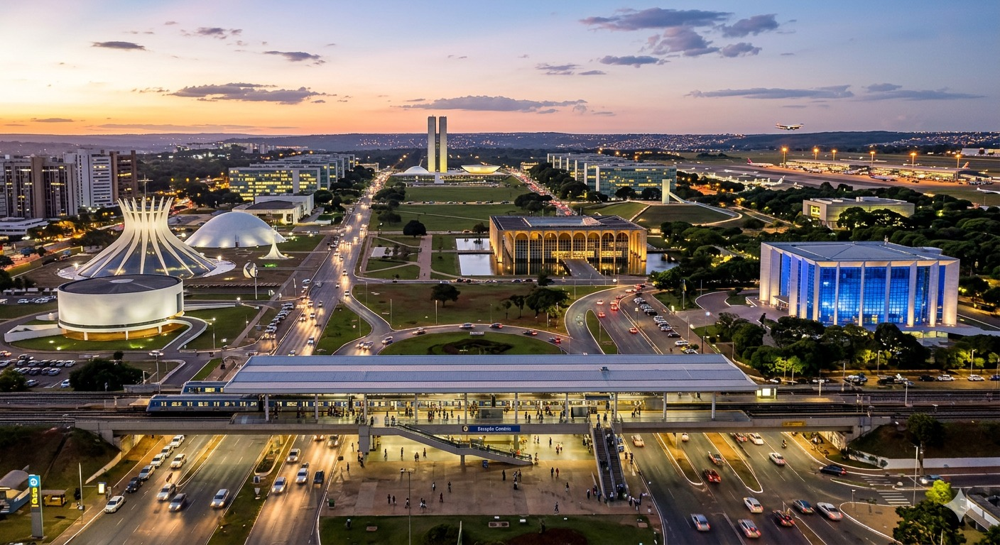
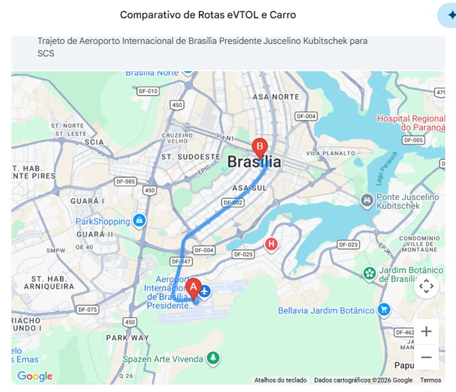
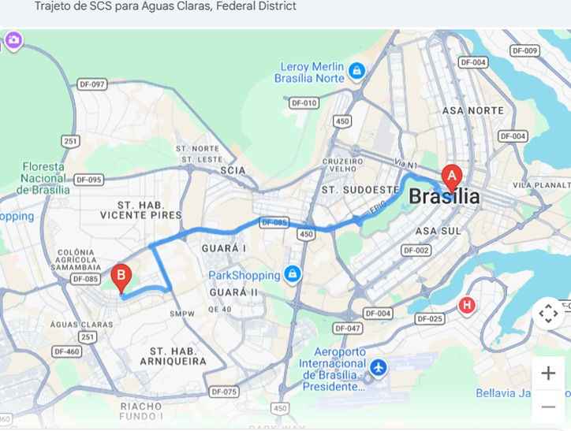
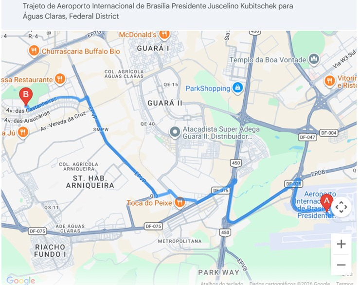

# Atividade 02 — Síntese Técnica, Operacional e Regulatória da UAM/AAM

**Disciplina:** Mobilidade Aérea Urbana — IT-214
**Instituto:** Instituto Tecnológico de Aeronáutica (ITA)
**Grupo:** Jaqueline Rodrigues · Luiz Tozi · Tariq Lopes · Gabriel Rufino · Giovanni Teles · Mírian Drago

---

## Objetivos

- Leitura e exercícios dos Blocos 1-5
- Apresentação detalhada sobre as cidades escolhidas.

## Desenvolvimento

### 1) Fundamentação e Análise Crítica (Bloco 1)

**Contexto:** UAM/AAM exige maturação simultânea em propulsão, energia, tráfego, infraestrutura, regulação e aceitação social.

### Convergências técnicas

- Avanços em baterias, propulsão elétrica e autonomia
- Menor ruído e maior segurança vs. helicópteros convencionais
- ATM tradicional insuficiente → necessidade de UTM/U-space
- Vertiportos com alto throughput, recarga rápida, conectividade digital (5G/6G)

### Divergências e limitações

- Adoção inicial restrita a nichos premium
- Gargalo crítico: densidade energética de baterias (alcance, carga útil, viabilidade econômica)

### 2) Aplicação Operacional e Infraestrutura (Bloco 2)

**Contexto:** Arquitetura das aeronaves determina procedimentos operacionais e dimensionamento de vertiportos.

### Dimensionamento de vertiportos

- **Asa rotativa:** menor footprint, áreas confinadas
- **Lift+Cruise/Tilt-wing:** maior área, envelopes laterais amplos
- **Tail-sitter:** menor área em solo, exige pé-direito específico

### Procedimentos e energia

- Perfil de operação (hover/transição/cruzeiro) impacta consumo e recarga
- Configurações eficientes em cruzeiro favorecem rotas médias

### Gestão do espaço aéreo

- Heterogeneidade de aeronaves aumenta complexidade de separação e sequenciamento
- UTM deve considerar modo de voo para previsão de conflito e coordenação

### 3) Estrutura Regulatória e Planejamento (Bloco 3)

### Facilitadores regulatórios

- Requisitos baseados em desempenho
- Sandboxes regulatórios para validação gradual

### Limitadores atuais

- Dependência de piloto a bordo em muitos cenários
- Ausência de protocolos consolidados para alto volume UAM integrado ao ATM

### Riscos comunitários críticos

- Ruído como vetor central de aceita ção pública
- Preocupações com privacidade e vigilância
- Risco de "gentrificação aérea" (benefícios concentrados, externalidades distribuídas)

### UAM x AAM

- **UAM:** urbano denso, alta complexidade operacional/regulatória
- **AAM:** guarda-chuva (urbano, regional, rural, carga), maior viabilidade inicial em áreas menos congestionadas

### 4) Estudo Técnico Comparativo de Categorias (Bloco 4)

#### 4.1 CTOL (Conventional Take-off and Landing)

**Exemplo:** eCaravan | **Alcance:** ~160 km | **Velocidade:** 320 km/h | **Capacidade:** 9 pax

- **Propulsão:** Motor elétrico + baterias íon-lítio
- **Uso:** Conexão regional entre cidades
- **Desafio:** Certificação elétrica (Part 23), gestão de peso de baterias
- **Infraestrutura:** Aeródromos convencionais, pistas longas, carregamento megawatt

#### 4.2 STOL (Short Take-off and Landing)

**Exemplo:** eSTOL | **Alcance:** ~800 km | **Velocidade:** 320 km/h | **Capacidade:** 9 pax

- **Propulsão:** Híbrida-elétrica com propulsão distribuída (sopro sobre asa)
- **Uso:** Regional, urbano periférico
- **Desafio:** Padrões para pistas curtas, controle de ruído
- **Infraestrutura:** STOLports, integração com zoneamento urbano

#### 4.3 VTOL / eVTOL (Vertical Take-off and Landing)

**Exemplo:** Joby S4 (tilt-rotor) | **Alcance:** ~240 km | **Velocidade:** 320 km/h | **Capacidade:** 1+4 pax

- **Propulsão:** Totalmente elétrica, 6 rotores basculantes
- **Uso:** Urbano denso, UAM, transporte executivo
- **Desafio:** Certificação da transição, Detect and Avoid em baixa altitude
- **Infraestrutura:** Vertiportos, recarga elétrica alta, áreas de aproximação íngremes

#### 4.4 Asa Rotativa (Helicóptero Convencional)

**Exemplo:** Airbus H125 | **Alcance:** ~630 km | **Velocidade:** 250 km/h | **Capacidade:** 5-6 pax

- **Propulsão:** Turbina a combustão (Turbomeca Arriel 2D)
- **Uso:** Multimissão, emergências médicas, VIP, operações rurais
- **Desafio:** Restrições de ruído urbano, custo de manutenção, emissões
- **Infraestrutura:** Helipontos, referência para dimensionamento de vertiportos

#### 4.5 UAS (Unmanned Aircraft Systems – Carga)

**Exemplo:** EHang 216-L | **Alcance:** ~35 km | **Velocidade:** 130 km/h | **Capacidade:** até 200 kg

- **Propulsão:** Totalmente elétrica, multirotor com 16 motores
- **Uso:** Logística urbana, entregas última milha, operações industriais
- **Desafio:** Segregação aérea, BVLOS, cibersegurança
- **Infraestrutura:** Hubs logísticos automatizados, integração com UTM

| Categoria | Exemplo | Alcance (aprox.) | Velocidade (aprox.) | Capacidade | Infraestrutura predominante | Principal desafio |
| --- | --- | --- | --- | --- | --- | --- |
| CTOL | eCaravan | 160 km | 320 km/h | 9 pax | Aeródromos convencionais | Peso/energia de baterias |
| STOL | Electra eSTOL | 800 km | 320 km/h | 9 pax | STOLports/pistas curtas | Padronização operacional e ruído |
| VTOL/eVTOL | Joby S4 | 240 km | 320 km/h | 1+4 pax | Vertiportos | Certificação da transição + DAA |
| Asa Rotativa | Airbus H125 | 630 km | 250 km/h | 5–6 pax | Helipontos | Ruído, custo e emissões |
| UAS (carga) | EHang 216-L | 35 km | 130 km/h | até 200 kg | Hubs logísticos automatizados | BVLOS, segregação e cibersegurança |

### Síntese técnica do comparativo

- **CTOL/STOL:** conectividade regional, alta dependência de pista
- **VTOL/eVTOL:** aderência urbana (UAM), alta demanda por vertiportos e energia
- **UAS:** infraestrutura mínima, desafios de integração no espaço aéreo compartilhado

### 5) Consolidação dos Pontos-Chave (Bloco 5)

### Desafios urbanos críticos

- Infraestrutura (vertiportos, interfaces com modais terrestres)
- Gerenciamento de tráfego de baixa altitude (UTM robusto)
- Aceitação social (ruído, segurança, benefício coletivo)

### Infraestruturas indispensáveis

- Vertiportos com operação, manutenção e turnaround ótimos
- UTM para planejamento e monitoramento em tempo real
- Rede energética de alta potência para recarga rápida

### Implicação estratégica

Sucesso da UAM depende de: **energia**, **coordenação de espaço aéreo** e **regulação orientada a risco**. Abordagem incremental (pilotos controlados, expansão por evidência) priorizando segurança e valor público.

## Conclusão

UAM é tecnicamente promissora condicionada por:

- **Energia:** densidade de baterias
- **Espaço aéreo:** coordenação UTM
- **Regulação:** orientada a risco

**Timelines:**

- **Curto prazo:** nichos operacionais e corredores específicos
- **Médio prazo:** escalabilidade (energia, vertiportos, aceitação)
- **Abordagem:** incremental (pilotos, avaliação, evidência), priorizando segurança e valor público

## Referências

1. Garrow, L. A., et al. (2021). Urban Air Mobility: A Comprehensive Review of Current Practice and Future Prospects.
2. Kiesewetter, P., et al. (2023). Advanced Air Mobility Communications and Networking: Recent Advances, Techniques, and Challenges.
3. Pak, H., et al. (2024). Can Urban Air Mobility become reality? Opportunities and challenges.
4. Arafat, M. Y., & Pan, S. (2024). Urban Air Mobility Communications and Networking.

---

## Brasília em 2026: Estrutura urbana, custo de vida e potencial para mobilidade aérea urbana

- Cidade única: capital funcional e monumental do Brasil
- Renda per capita: ~R$5.400/mês (maior do país)
- Gasto médio: ~R$4.920/mês
- Forte desigualdade espacial de renda
- **Desafio:** mobilidade pendular Plano Piloto ↔ Regiões Administrativas
- **Oportunidade:** UAM como solução para gargalos viários

## Highlights

- Alto valor urbanístico + pressão de mobilidade pendular
- **Triângulo logístico UAM:** Aeroporto ↔ Plano Piloto ↔ Águas Claras
- **Ganho de tempo:** 6–10 min (eVTOL) vs. 25–70 min (carro em pico)
- Requer: integração multimodal, vertiportos, coordenação regulatória

---

## Arquitetura e cultura

- Maior área urbana tombada do mundo (UNESCO)
- Identidade: curvas de Oscar Niemeyer + planejamento de Lúcio Costa

**Eixo Monumental:** Congresso, Palácio do Planalto, STF, Palácio Itamaraty

**Museus principais:** Museu da República, Memorial JK, CCBB Brasília

**Arquitetura religiosa:** Catedral (anjos suspensos), Santuário Dom Bosco (vitrais azuis)

---

## Brasília visto de cima

[Imagens de Brasília do interior da cidade]

---

## O Aeroporto Internacional de Brasília

- Principal hub aeroportuário da América Latina
- Conecta Norte/Nordeste ↔ Sul/Sudeste
- Infraestrutura: Aeroporto Square (cinema, lojas, restaurantes)

---

## Mobilidade e trânsito

**Planejamento original:** prioridade ao transporte automotivo → pressão viária em Plano Piloto ↔ Regiões Administrativas

**Modais:**

- **BRT:** Santa Maria, Gama (corredor Eixo Oeste)
- **Metrô:** formato Y → Ceilândia, Samambaia (via Asa Sul, Guará, Águas Claras)
- **Rodovias:** Eixão, L4, EPTG, EPIA

**Congestionamento:**

- Manhã: 06:30 – 09:00
- Noite: 17:30 – 19:45
- Eixão do Lazer (domingos/feriados, 06:00–18:00)

---

## Perfil socioeconômico e renda

Brasília apresenta grande desigualdade espacial de renda. Embora o Distrito Federal tenha a maior renda per capita do Brasil, superior a aproximadamente **R$5.400 mensais em média em 2026**, as diferenças entre regiões são significativas.

| Região | Perfil de renda |
| --- | --- |
| Lago Sul / Lago Norte | Áreas de altíssima renda, com renda domiciliar superior a R$30.000 |
| Plano Piloto / Sudoeste | Alta renda, concentrando servidores públicos federais |
| Águas Claras | Classe média alta, forte verticalização |
| Sol Nascente / Pôr do Sol | Regiões com maior vulnerabilidade social |

---

## Custo de vida em 2026

**Gasto médio mensal:** ~R$4.920

- **Moradia:** principal componente, varia significativamente por região
- **Alimentação:** custos elevados (supermercados e restaurantes)
- **Transporte:** deslocamentos longos ampliam despesas
- **Serviços/Lazer:** entre os mais altos do Brasil

## Diferenças regionais no custo de vida

**Plano Piloto:**

- Custo imobiliário muito elevado, proximidade de serviços
- Perfil: servidores públicos, diplomatas, executivos

**Regiões de classe média (Águas Claras, Guará):**

- Custo intermediário, forte verticalização, acesso a metrô
- Desafio: deslocamentos diários

**Regiões administrativas periféricas (Ceilândia, Santa Maria, Sol Nascente):**

- Menor custo, maior dependência de transporte público
- Problema: longos deslocamentos

## Planejamento financeiro no DF

- **Armadilha do deslocamento:** morar longe reduz aluguel mas aumenta custos indiretos (combustível, tempo, logística)
- **Orçamento familiar (4 pessoas):** pode ultrapassar R$13.000/mês (educação, saúde, transporte)
- lazer

---

## Vertiportos e mobilidade aérea urbana

A implantação de vertiportos em Brasília representa uma possível solução estrutural para os desafios de mobilidade da capital.

Vertiportos são infraestruturas dedicadas à operação de aeronaves elétricas de decolagem vertical (**eVTOLs**), frequentemente chamadas de carros voadores.

---

## Estrutura potencial da rede aérea urbana

Um modelo inicial pode ser estruturado em um triângulo logístico conectando:

- Aeroporto Internacional de Brasília
- Plano Piloto
- Águas Claras

---

## Distâncias e tempos estimados

| Rota | Distância aproximada | Tempo eVTOL | Tempo carro (pico) |
| --- | --- | --- | --- |
| Aeroporto → Plano Piloto | ~10 km | 6–8 min | 25–45 min |
| Aeroporto → Águas Claras | ~12 km | 7–9 min | 35–60 min |
| Plano Piloto → Águas Claras | ~15 km | 8–10 min | 40–70 min |

## Ilustração das rotas (mapas)

### 1) Aeroporto → Plano Piloto

**Interpretação:** trajeto entre o Aeroporto Internacional de Brasília (A) e o Plano Piloto/SCS (B).

*Figura 1 — Rota Aeroporto → Plano Piloto.*

### 2) Plano Piloto → Águas Claras

**Interpretação:** trajeto entre o Plano Piloto/SCS (A) e Águas Claras (B).

*Figura 2 — Rota Plano Piloto → Águas Claras.*

### 3) Aeroporto → Águas Claras

**Interpretação:** trajeto direto entre o Aeroporto Internacional de Brasília (A) e Águas Claras (B).

*Figura 3 — Rota Aeroporto → Águas Claras.*

**Leitura comparativa:** os três mapas reforçam o triângulo logístico proposto para implantação inicial da rede de vertiportos e evidenciam o potencial de ganho de tempo nos deslocamentos pendulares.

---

### Vertiporto Plano Piloto

Integrado ao Setor Comercial Sul + eixos de ônibus/metrô

### Vertiporto Águas Claras

Próximo à estação de metrô + conexão com sistema ferroviário urbano

---

## Corredores de voo

- Operação de eVTOLs: baixa altitude (~1.000 pés)
- Eixão como corredor natural → reduz impacto acústico  em áreas residenciais

---

## Desafios institucionais

- **Tombamento do Plano Piloto:** restringe novas construções → vertiportos em topos de edifícios, estacionamentos, estruturas existentes
- **Escalabilidade:** requer alta frequência de voos e sistemas digitais avançados de gestão de tráfego

---

## Justificativa estratégica para Brasília

- **Geografia urbana espraiada:** gargalos viários entre Plano Piloto e regiões administrativas
- **Hub aeroportuário nacional:** Aeroporto JK para centros administrativos/hoteleiros
- **Perfil governamental/diplomático:** demanda por deslocamentos rápidos e previsíveis

## Impactos econômicos potenciais

- **Empregos:** engenharia aeronáutica, manutenção elétrica, gestão aéreo-urbana, TI
- **Valorização imobiliária:** hotéis, centros comerciais, polos empresariais próximos a vertiportos
- **Produtividade:** redução 90 min → 10 min de deslocamento = tempo liberado para profissionais/empresas

---

## Desafios de equidade

- Operação inicial como serviço premium
- Escalabilidade pode reduzir custos gradualmente
- **Crítico:** integração com transporte público para evitar sistema isolado

---

## Fontes de dados e instituições relevantes

## Estatísticas e economia

- IPEDF – Instituto de Pesquisa e Estatística do Distrito Federal: [https://www.ipe.df.gov.br](https://www.ipe.df.gov.br)
- IBGE – Instituto Brasileiro de Geografia e Estatística: [https://www.ibge.gov.br](https://www.ibge.gov.br)
- Plataforma de dados municipais: [https://cidades.ibge.gov.br](https://cidades.ibge.gov.br)

---

## Mobilidade urbana

SEMOB-DF – Secretaria de Transporte e Mobilidade
Informações sobre metrô, ônibus e projetos viários.

- Agência Brasília: [https://www.agenciabrasilia.df.gov.br](https://www.agenciabrasilia.df.gov.br)

---

## Mobilidade aérea urbana

ANAC – Agência Nacional de Aviação Civil
Responsável pela certificação e regulamentação.

- [https://www.gov.br/anac](https://www.gov.br/anac)

Eve Air Mobility
Empresa brasileira de desenvolvimento de eVTOL e ecossistemas de mobilidade aérea.

- [https://www.eveairmobility.com](https://www.eveairmobility.com)
