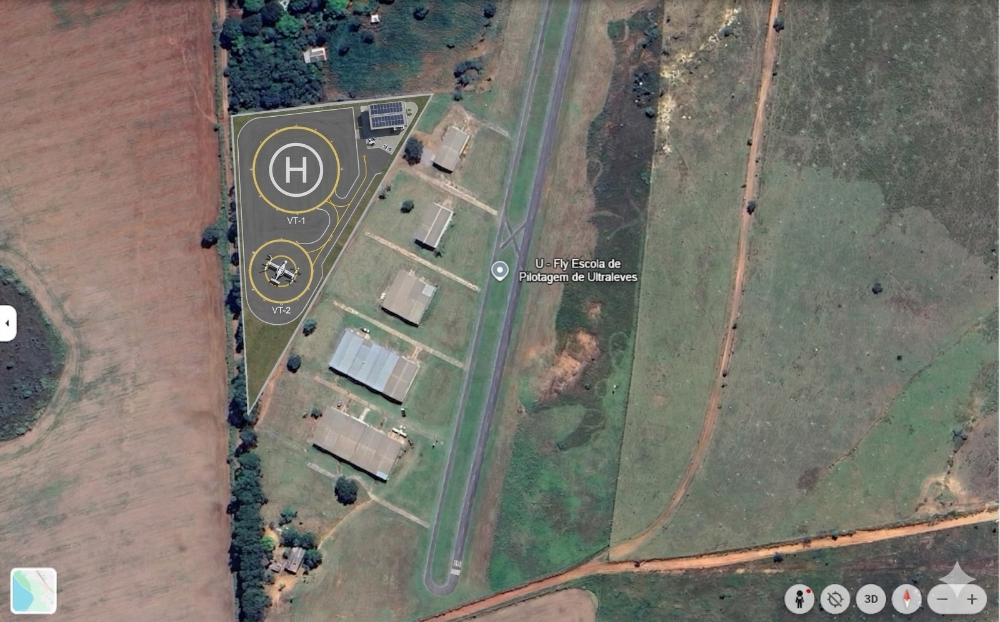
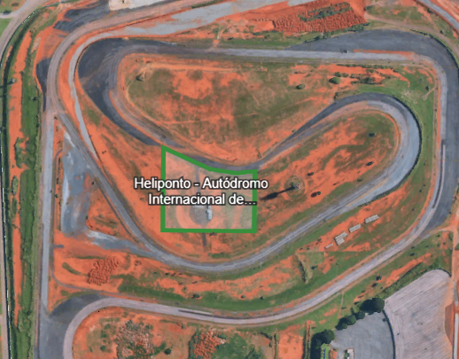

# Atividade 03 — Seleção de três Sítios

**Disciplina:** Mobilidade Aérea Urbana — IT-214  
**Instituto:** Instituto Tecnológico de Aeronáutica (ITA)  
**Grupo:** Jaqueline Rodrigues · Luiz Tozi · Nickolas Victor · Gabriel Rufino · Giovanni Teles · Mírian Drago

---

## Objetivos

- Consolidar os 3 sítios priorizados em Brasília para implantação inicial de vertiportos.
- Exibir o resultado de forma visual e interativa (mapa, tabela e gráfico).
- Documentar, de forma mínima, o racional de escolha de cada região.

## Painel Interativo dos Sítios

<iframe
	src="atv03-sitios.html"
	title="Atividade 03 - Sítios UAM Brasília"
	style="width:100%; height:2700px; border:1px solid #dde3ec; border-radius:12px; background:#fff;"
	loading="lazy"
></iframe>

## Painel da Matriz AHP

<iframe
	src="atv03-ahp.html"
	title="Atividade 03 - Matriz AHP"
	style="width:100%; height:1300px; border:1px solid #dde3ec; border-radius:12px; background:#fff;"
	loading="lazy"
></iframe>

## Síntese da seleção 

Foram avaliados **sete sítios** por complementaridade operacional na malha inicial de UAM em Brasília. A seleção final considera **seis sítios**:

**Sítios definidos:**
- **Sítio A — Asa Norte / Autódromo Internacional:** centralidade urbana e alta densidade de destinos administrativos e corporativos.
- **Sítio B — Terminal SBBR (landside controlado):** concentração de demanda aeroportuária e conexão nacional.
- **Sítio C — CBAAER:** alternativa estratégica incorporada à seleção final por complementaridade operacional da rede.
- **Sítio D — Águas Claras (eixo rodoviário):** alternativa complementar de acesso terrestre e distribuição de demanda local.
- **Sítio E — LAGOA 2:** conectividade urbana com vertiporto já dimensionado.
- **Sítio F — Sarah:** localização estratégica de complementaridade com vertiporto definido.

**Sítio fora da seleção final (referência histórica):**
- **Alternativa inicial — Águas Claras (eixo metroviário):** sítio inicial de estudo, posteriormente substituído na etapa final.

O **Águas Claras (eixo metroviário)** foi um sítio inicial de estudo, mas foi **substituído** pelo **Águas Claras (eixo rodoviário)** por apresentar melhor afastamento das áreas próximas a escolas e hospitais na análise com buffer de 400 m.

Essa configuração final de seis sítios forma uma rede logística de curta/média distância com estruturas de vertiportos já dimensionadas, oferecendo alto potencial de ganho de tempo em horários de pico.

## Galeria dos locais específicos 

### Sítio A — Asa Norte / Autódromo Internacional

### Sítio B — Aeroporto Internacional de Brasília (BSB)

### Sítio C — CBAAER

### Sítio D — Águas Claras (eixo rodoviário)

### Sítio E — Lagoa (com vertiporto)

### Sítio F — Sarah (com vertiporto)

### Alternativa inicial — Águas Claras (eixo metroviário)

---

## Média consolidada das avaliações do grupo

A tabela a seguir consolida a **média aritmética simples** das cinco avaliações individuais submetidas pelos membros do grupo para os seis sítios e oito critérios AHP. A pontuação final ponderada é calculada com os pesos calibrados: **Segurança** = 27,09%; **Ruído** = 23,90%; **Acessibilidade** = 17,93%; **Impacto Ambiental** = 10,82%; **Infraestrutura** = 9,84%; **Privacidade** = 4,08%; **Eficiência** = 4,02%; **Horas de Operação** = 2,31%.

| Critério | Peso | Sítio A | Sítio B | Sítio C | Sítio D | Sítio E | Sítio F |
|---|---|---|---|---|---|---|---|
| Infraestrutura disponível | 9,8% | 7,40 | 8,60 | 6,40 | 7,80 | 5,20 | 7,00 |
| Ruído | 23,9% | 7,40 | 6,80 | 7,00 | 6,60 | 6,80 | 5,80 |
| Acessibilidade | 17,9% | 7,80 | 7,80 | 6,00 | 7,60 | 7,80 | 7,40 |
| Privacidade | 4,1% | 5,80 | 7,00 | 7,60 | 6,40 | 6,40 | 5,60 |
| Eficiência | 4,0% | 7,00 | 7,20 | 6,40 | 6,00 | 5,60 | 5,60 |
| Horas de Operação | 2,3% | 7,00 | 8,20 | 7,20 | 5,80 | 4,80 | 4,00 |
| Impacto Ambiental | 10,8% | 7,00 | 6,40 | 6,40 | 6,60 | 6,00 | 6,80 |
| Segurança | 27,1% | 8,20 | 7,40 | 7,80 | 5,80 | 6,60 | 5,80 |
| **Pontuação Final S_i** | | **7,5546** | **7,3322** | **6,9185** | **6,6299** | **6,5705** | **6,2555** |
| **Ranking (1 = melhor)** | | **#1** | **#2** | **#3** | **#4** | **#5** | **#6** |

**Fonte:** Médias das cinco avaliações individuais dos membros do grupo; pontuação ponderada com pesos AHP calibrados (caderno de justificativas, 2025).

---

## Síntese comparativa dos seis sítios vertiportuários selecionados

| Critério | Sítio A — Asa Norte / Autódromo Internacional | Sítio B — Terminal SBBR | Sítio C — CBAAER | Sítio D — Águas Claras | Sítio E — LAGOA 2 | Sítio F — Sarah |
|---|---|---|---|---|---|---|
| Infraestrutura disponível | Área central com infraestrutura urbana consolidada: rede elétrica, vias estruturadas, pavimentação, iluminação e drenagem já instaladas. Ainda exige adequações específicas de área operacional e compatibilização fina com o entorno. | Alternativa mais madura em infraestrutura: combina rede elétrica, pavimentação, acessos organizados e cultura operacional aeroportuária. Exige o menor esforço de complementação física entre todas as alternativas. | Possui base física e controle institucional favoráveis, com organização de energia e acessos internos. Para uso civil regular, demanda maior adaptação de interface e serviços de apoio em comparação a A e B. | Beneficia-se do eixo rodoviário e do acesso terrestre, mas ainda depende de implantação dedicada de infraestrutura vertiportuária e organização de apoio operacional. | A existência de vertiporto já dimensionado é vantagem concreta, mas o suporte urbano e operacional permanece menos robusto do que em A e B. | Viabilidade física e localização estratégica confirmadas, porém demandaria adequações adicionais em infraestrutura de apoio, circulação e organização do entorno. |
| Ruído | O uso associado ao Autódromo favorece maior tolerância acústica relativa, auxiliando na absorção do ruído aeronáutico. A centralidade ainda impõe convivência com tecido urbano sensível. | O contexto aeroportuário já convive com atividade aeronáutica, melhorando a compatibilidade acústica. A interface landside exige desenho operacional cuidadoso e disciplina sonora. | O ambiente institucional e controlado tende a ser menos sensível ao ruído do que áreas urbanas abertas. A compatibilização fina com aproximações e a sensibilidade local do entorno ainda seria necessária. | O eixo rodoviário já convive com ruído de tráfego, favorecendo absorção do ruído aeronáutico. O adensamento urbano adjacente reduz a margem acústica disponível. | Apesar da conectividade urbana, o entorno é relativamente mais sensível ao ruído, tornando o critério mais restritivo em comparação às áreas aeroportuárias e institucionais. | A sensibilidade do entorno e a menor folga acústica relativa tornam o critério menos favorável. A operação é possível, mas requer mitigação ativa. |
| Acessibilidade | Melhor centralidade urbana, bem conectada aos polos administrativos e corporativos, com boa capilaridade viária, integração modal e facilidade de chegada dos usuários. | Acessibilidade muito forte para demanda aeroporto-cidade e conexões nacionais, mas com atratividade mais especializada e menos central para o conjunto dos deslocamentos urbanos cotidianos. | Acessível e funcional como sítio complementar, porém menos central e mais distante dos principais polos geradores de demanda urbana. | Ponto forte na conexão pelo eixo rodoviário, com boa distribuição terrestre da demanda. Fica abaixo de A por não reunir a mesma densidade de destinos estratégicos e corporativos. | Conectividade urbana satisfatória, captando viagens em escala local ou complementar. Não atinge o mesmo desempenho estrutural de A, mas é equiparável a B e F. | Pode cumprir papel complementar de acesso, com menor centralidade e capilaridade para o conjunto da demanda urbana. |
| Privacidade | Embora seja possível organizar acessos e segregar a operação, o sítio está inserido em área central e mais exposta à presença de terceiros. A privacidade depende de soluções de projeto e gestão. | O ambiente landside controlado oferece boa capacidade de controle de acesso, filtragem de usuários e organização da interface entre passageiros e operação. | Uma das alternativas com melhor capacidade de segregação, menor exposição de terceiros e maior controle do perímetro operacional. | Condição intermediária: é possível organizar o acesso, mas sem o mesmo nível de fechamento e separação natural observado nos sítios institucionais B e C. | A inserção urbana amplia a exposição do entorno e dificulta manter a operação plenamente segregada de terceiros. | Localização permite desenho de acesso mais dedicado e favorece algum grau de segregação operacional, embora abaixo do nível alcançado em C. |
| Eficiência | Sítio que melhor reduz tempo porta a porta para viagens de maior valor e melhor conecta a operação aos polos mais densos de demanda, entregando o maior retorno sistêmico da rede. | Extremamente eficiente para integrar aeroporto e cidade, concentrando demanda qualificada e conexão nacional. Eficiência mais especializada na função aeroporto-cidade em comparação ao retorno sistêmico geral de A. | Agrega valor à rede por complementaridade operacional e robustez institucional, porém com produtividade imediata de demanda menor do que A e B. | Funciona bem como apoio de distribuição local, mas não lidera a rede em captação de demanda nem em ganho sistêmico agregado. | Pode cumprir papel de apoio urbano e reforço de rede, porém com retorno sistêmico inferior ao de A, B e C. | Função claramente complementar, sem a mesma capacidade de concentrar demanda ou maximizar ganhos sistêmicos. |
| Horas de operação | Vocação operacional e robustez da área permitem trabalhar com janela relativamente ampla, desde que compatibilizada com o entorno urbano. | O ambiente aeroportuário controlado oferece a maior previsibilidade e o maior potencial de janela operacional extensa entre todas as alternativas. | O ambiente institucional favorece boa disponibilidade operacional e maior capacidade de organização de janelas de uso. | Pode operar com janela razoável, mas permanece mais condicionado pela convivência urbana e pela sensibilidade do entorno. | A inserção urbana tende a impor maior restrição de horários e maior necessidade de compatibilização com a vizinhança. | Necessidade de maior cautela com o entorno e usos adjacentes restringe a extensão da janela diária. |
| Impacto ambiental | Aproveita área já antropizada e evita expansão sobre novos sítios. A operação em área central aumenta a sensibilidade das externalidades urbanas. | Concentra a operação em área já associada à atividade aeronáutica, reduzindo necessidade de abrir novos polos de impacto e favorecendo racionalidade territorial. | A inserção em área institucional ajuda a conter a dispersão de impactos e permite organizar melhor a operação em sítio já controlado. | Aproveita eixo já estruturado, o que é ambientalmente melhor que implantação totalmente dispersa, mas permanece em interface sensível com o meio urbano consolidado. | Mesmo com vertiporto já dimensionado, a inserção urbana amplia a sensibilidade do entorno às externalidades da operação. | Pode preencher lacunas da rede sem exigir expansão desordenada. A relação com o entorno requer gestão cuidadosa das externalidades. |
| Segurança | Combina controle viável de acessos, boa estrutura urbana de apoio, resposta rápida de emergência e posição operacionalmente robusta para atendimento dos principais fluxos. | Ambiente fortemente controlado, com procedimentos consolidados e cultura de segurança própria do contexto aeroportuário. A interface landside adiciona complexidade à gestão de fluxos de usuários e veículos. | Forte controle de perímetro, capacidade de segregação e menor conflito direto com fluxos urbanos intensos. | Acessos claros e boa resposta terrestre contribuem para segurança adequada, embora a interface mais direta com fluxos urbanos e viários aumente a exposição a conflitos. | A segurança é viável, mas depende de tratamento mais intenso da interface com pedestres, tráfego local e usos vizinhos. | A operação pode ser estruturada com segurança, mas a necessidade de protocolos mais estritos e de maior proteção do entorno reduz sua competitividade relativa. |

**Fonte:** Elaboração própria com base nos critérios da disciplina e nas justificativas analíticas do caderno AHP (2025).

## Critério de ruído e proteção de receptores sensíveis

Além de conectividade e demanda, a seleção considerou literatura técnica sobre impacto acústico de UAM, incluindo o artigo **Determination of the noise impact range of urban air mobility**. Como referência prática de triagem espacial, adotamos uma faixa de influência horizontal de **400 m a 600 m** para evitar implantação muito próxima de receptores sensíveis.

O mapa interativo acima exibe uma camada de análise com:

- **Escolas/Hospitais** georreferenciados em Brasília;
- **Buffer de 400 m** (zona sensível — em roxo);
- **Buffer de 600 m** (limite de cautela — em laranja).

Essa análise visual permite identificar espacialmente quais sítios guardam distâncias adequadas de receptores sensíveis, alinhado com as recomendações do artigo.

## Decisão final — Sítio A: Asa Norte / Autódromo Internacional

A aplicação da Matriz AHP com as cinco avaliações consolidadas do grupo resultou na seleção do **Sítio A — Asa Norte / Autódromo Internacional** como o sítio prioritário para implantação inicial do vertiporto em Brasília, com a maior pontuação ponderada entre os seis candidatos (**S_i = 7,5546**, ranking **#1**).

O resultado reflete o desempenho superior do sítio nos critérios de maior peso: **Segurança** (média 8,20 — melhor entre todos os sítios), **Ruído** (média 7,40 — compatível com o entorno do Autódromo), **Acessibilidade** (média 7,80 — maior centralidade urbana da rede) e **Eficiência** (média 7,00 — melhor retorno porta a porta para os fluxos de maior valor). A combinação dessas vantagens, ponderadas pelos pesos AHP calibrados, consolidou o Sítio A como a alternativa de maior atratividade global para a rede UAM de Brasília.

## Referências

1. Projeto Google Earth do grupo (sítios em Brasília).
2. ANAC - diretrizes e materiais sobre AAM/UAM e certificação: https://www.gov.br/anac
3. SEMOB-DF e IPEDF - dados de mobilidade e dinâmica urbana do DF.
4. Determination of the noise impact range of urban air mobility. Seung-Min Lee, Seong-Yong Wie, Won-Hak Lee e Chan-Hoon Haan. https://doi.org/10.1121/10.0042757