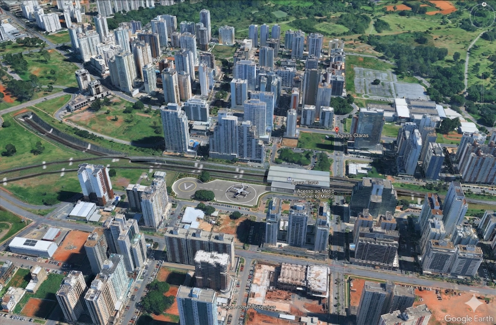
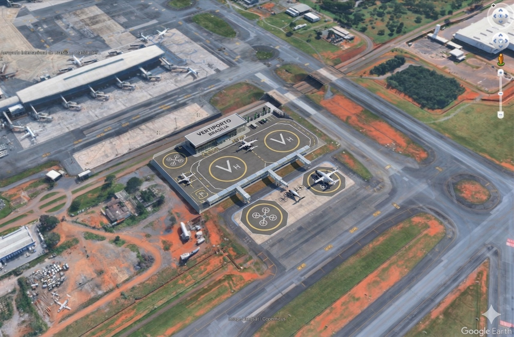
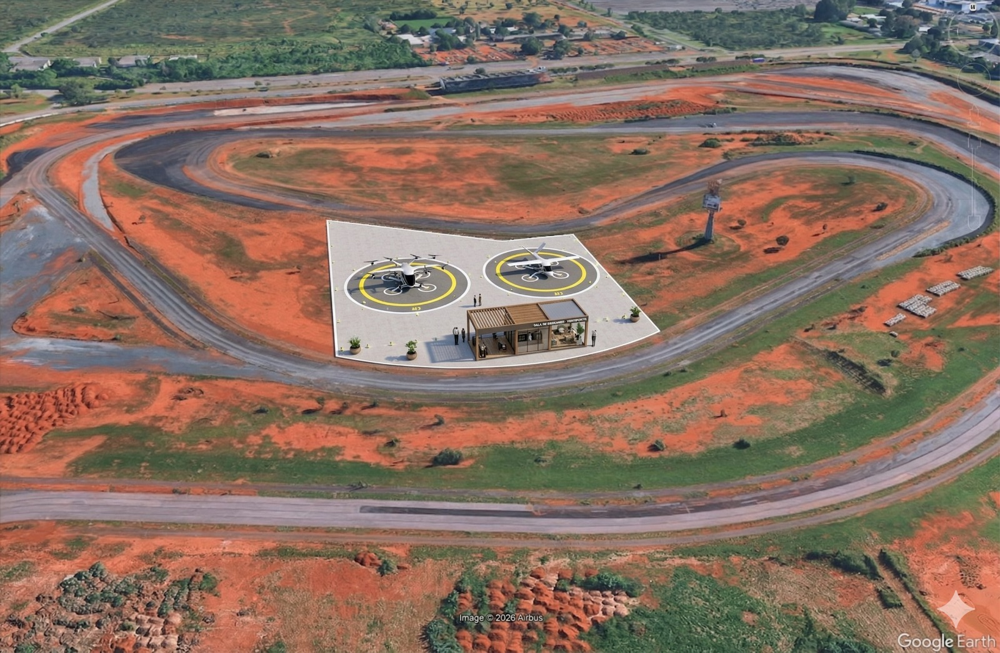
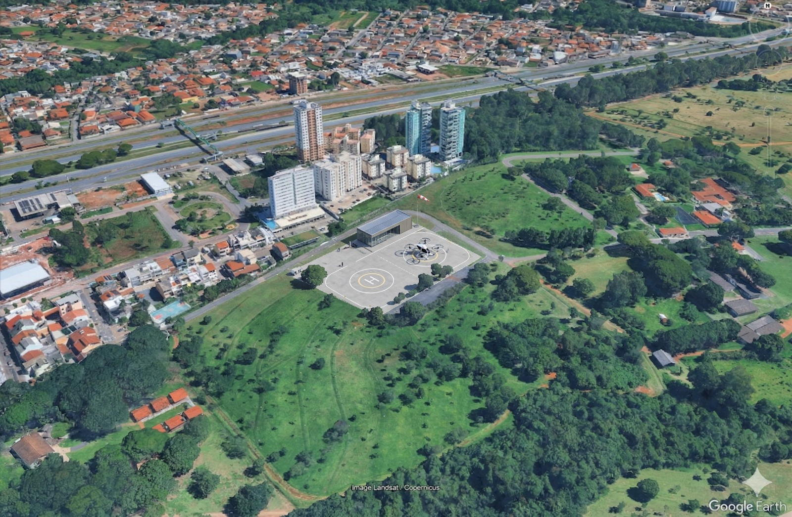
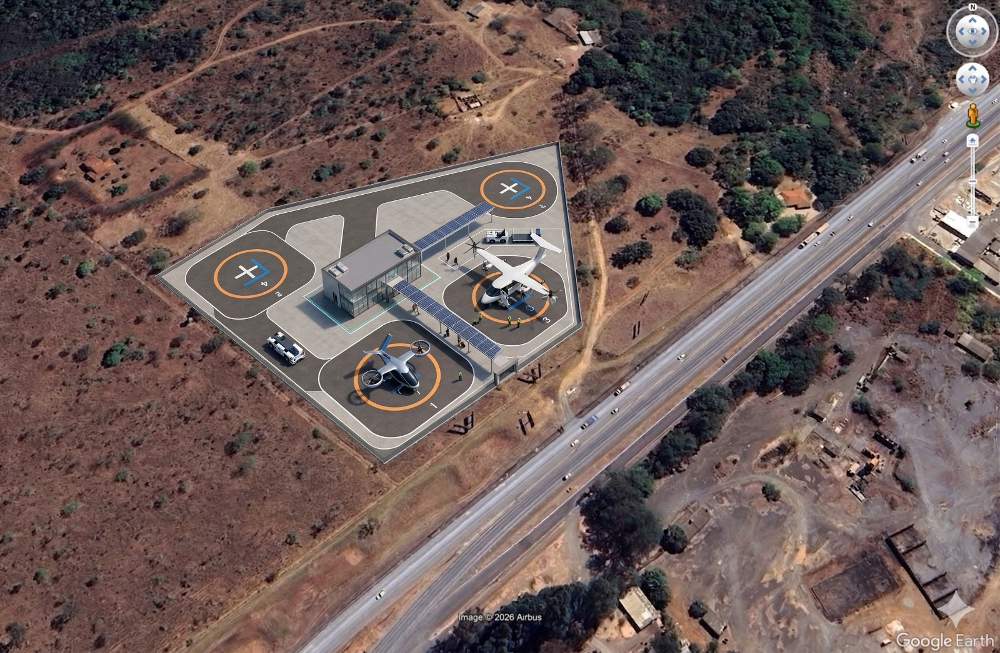
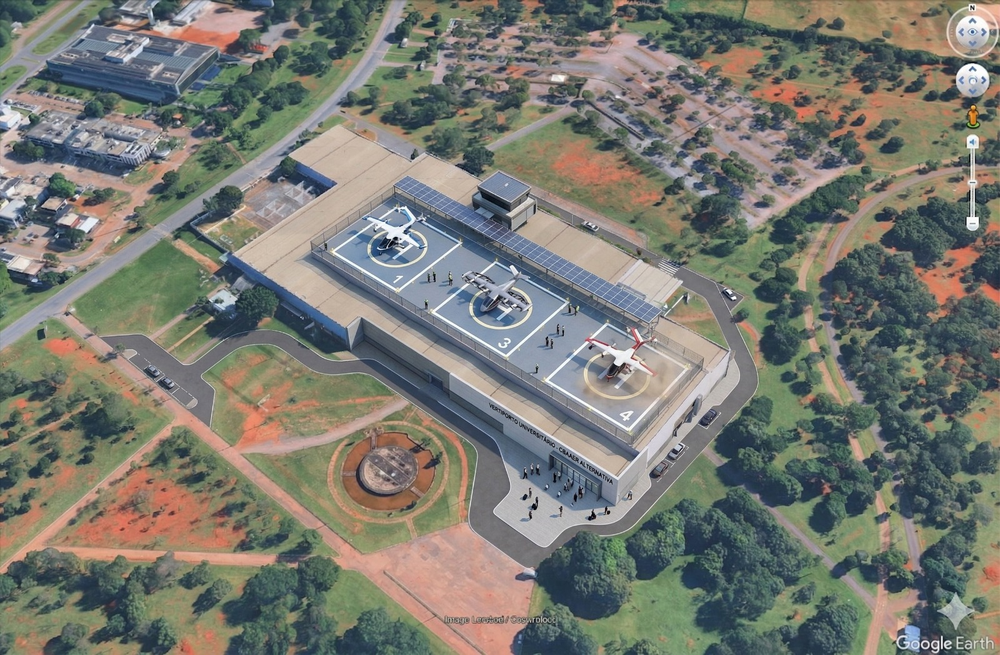
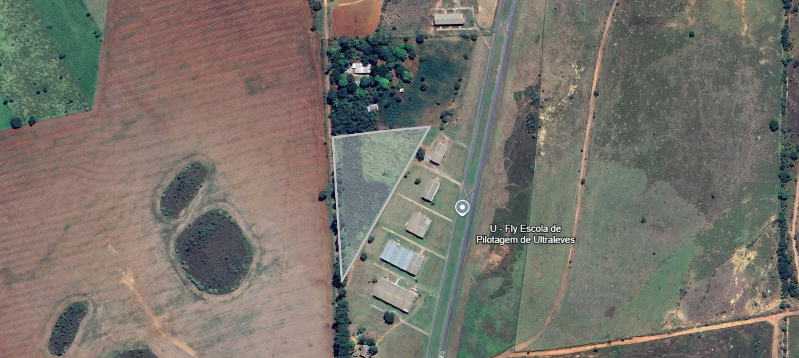

# Atividade 03 — Seleção de três Sítios

**Disciplina:** Mobilidade Aérea Urbana — IT-214  
**Instituto:** Instituto Tecnológico de Aeronáutica (ITA)  
**Grupo:** Jaqueline Rodrigues · Luiz Tozi · Nickolas Victor · Gabriel Rufino · Giovanni Teles · Mírian Drago

---

## Objetivos

- Consolidar os 3 sítios priorizados em Brasília para implantação inicial de vertiportos.
- Exibir o resultado de forma visual e interativa (mapa, tabela e gráfico).
- Documentar, de forma mínima, o racional de escolha de cada região.

## Painel Interativo dos Sítios

<iframe
	src="atv03-sitios.html"
	title="Atividade 03 - Sítios UAM Brasília"
	style="width:100%; height:2200px; border:1px solid #dde3ec; border-radius:12px; background:#fff;"
	loading="lazy"
></iframe>

## Painel da Matriz AHP

<iframe
	src="atv03-ahp.html"
	title="Atividade 03 - Matriz AHP"
	style="width:100%; height:2400px; border:1px solid #dde3ec; border-radius:12px; background:#fff;"
	loading="lazy"
></iframe>

## Síntese da seleção 

Foram avaliados **sete sítios** por complementaridade operacional na malha inicial de UAM em Brasília. A seleção final considera **cinco sítios selecionados** (mais **1 em desenvolvimento**):

**Sítios com vertiportos definidos:**
- **Sítio B — Aeroporto Internacional de Brasília (BSB):** concentração de demanda aeroportuária e conexão nacional.
- **Sítio C — Asa Norte (Autódromo):** alta densidade de destinos administrativos, corporativos e hoteleiros.
- **Sítio D — Águas Claras (eixo rodoviário):** alternativa complementar de acesso terrestre e distribuição de demanda local.
- **Sítio E — Lagoa:** conectividade urbana com vertiporto já dimensionado.
- **Sítio F — Sarah:** localização estratégica de complementaridade com vertiporto definido.

**Em desenvolvimento:**
- **Sítio G — CBAAER:** avaliação em andamento para potencial futuro.

O **Águas Claras (eixo metroviário)** foi um sítio inicial de estudo, mas foi **substituído** pelo **Águas Claras (eixo rodoviário)** por apresentar melhor afastamento das áreas próximas a escolas e hospitais na análise com buffer de 400 m.

Essa configuração final de cinco sítios + um em desenvolvimento forma uma rede logística de curta/média distância com estruturas de vertiportos já dimensionadas, oferecendo alto potencial de ganho de tempo em horários de pico.

## Galeria dos locais específicos 

### Alternativa inicial — Águas Claras (eixo metroviário)

### Sítio B — Aeroporto Internacional de Brasília (BSB)

### Sítio C — Asa Norte (Autódromo)

### Sítio D — Águas Claras (eixo rodoviário)

### Sítio E — Lagoa (com vertiporto)

### Sítio F — Sarah (com vertiporto)

### Sítio G — CBAAER (em desenvolvimento)

## Síntese comparativa dos cinco sítios vertiportuários selecionados

| Critério | Sítio B - Terminal SBBR | Sítio C - Asa Norte / Autódromo | Sítio D - Águas Claras | Sítio E - Lagoa | Sítio F - Sarah |
|---|---|---|---|---|---|
| Infraestrutura disponível | Infraestrutura aeronáutica superior, porém com maior dependência do operador aeroportuário, acesso à rampa e compatibilização regulatória. | Área já urbanizada, boa disponibilidade de utilidades e implantação mais demonstrável fora do lado ar controlado. | Boa infraestrutura urbana, mas com menor folga espacial e maior sensibilidade do entorno edificado. | Vertiporto já dimensionado, infraestrutura compatível com operação de UAM. | Vertiporto já dimensionado, infraestrutura pré-planejada. |
| Ruído | Ambiente já associado à atividade aeronáutica, com melhor tolerância relativa ao ruído adicional. | Entorno urbano central, porém menos sensível que Águas Claras e com melhor margem para gestão operacional. | Maior sensibilidade acústica pela proximidade de uso residencial denso e permanência de terceiros. | Sensibilidade moderada; localização adequada para buffers de proteção. | Sensibilidade moderada; distância considerada de áreas críticas. |
| Acessibilidade | Boa acessibilidade regional, mas menos eficiente para o destino urbano final. | Melhor equilíbrio urbano. Centralidade, conexão viária e aderência à lógica porta a porta da UAM. | Boa acessibilidade local e demanda potencial, porém com menor capacidade de organizar fluxos de acesso dedicados. | Boa acessibilidade urbana, conectividade multimodal potencial. | Excelente conectividade urbana, localização chave para integração modal. |
| Privacidade | Maior afastamento de terceiros e melhor controle físico do acesso, embora sob regras aeroportuárias mais rígidas. | Entorno mais controlável que Águas Claras e sem a complexidade de áreas restritas aeroportuárias. | Maior exposição de terceiros, fachadas residenciais e conflitos com o uso cotidiano do entorno. | Bom isolamento do entorno residencial imediato. | Bom controle de fluxo e isolamento operacional. |
| Eficiência | Muito forte como nó operacional, mas menos aderente à demonstração de mobilidade urbana central. | Melhor coerência para referência acadêmica de UAM urbana, por combinar centralidade e viabilidade de acesso. | Capta demanda urbana, porém com maior custo de mitigação operacional e social. | Forte potencial de captura de demanda urbana com vertiporto definido. | Potencial de demonstração integrada com forte conectividade. |
| Horas de operação | Pode enfrentar condicionantes de área controlada, coordenação operacional e rotinas aeroportuárias. | Maior flexibilidade conceitual para discutir operação urbana sem depender diretamente do regime do aeroporto. | Tende a demandar mais restrições horárias por sensibilidade do entorno residencial. | Flexibilidade operacional com restrições moderadas. | Flexibilidade operacional com boa margem de manobra. |
| Impacto ambiental | Área também intensamente transformada, mas com condicionantes institucionais e operacionais mais complexos. | Área já modificada pela ação humana, com boa possibilidade de inserção conceitual sem ampliar pressões ambientais críticas. | Inserção em área urbana densa, com maior potencial de percepção negativa quanto a ruído e qualidade ambiental local. | Inserção adequada com mitigação planejada; área já modificada. | Inserção com baixo impacto ambiental adicional; infraestrutura compatível. |
| Segurança | Muito forte em segurança operacional, mas condicionado a requisitos aeroportuários, acesso restrito e governança complexa. | Boa capacidade de desenho conceitual com separação de fluxos, menor fricção institucional e melhor narrativa de implantação. | Mais crítico em conflitos pedestre–aeronave, exposição de terceiros e gestão do entorno. | Segurança operacional com vertiporto já planejado; fluxos definidos. | Segurança reforçada com projeto preexistente do vertiporto. |

**Fonte**. Elaboração própria com base nos critérios da disciplina e na comparação técnica de todos os sítios (B, C, D, E, F) e em avaliação de G.

## Critério de ruído e proteção de receptores sensíveis

Além de conectividade e demanda, a seleção considerou literatura técnica sobre impacto acústico de UAM, incluindo o artigo **Determination of the noise impact range of urban air mobility**. Como referência prática de triagem espacial, adotamos uma faixa de influência horizontal de **400 m a 600 m** para evitar implantação muito próxima de receptores sensíveis.

O mapa interativo acima exibe uma camada de análise com:

- **Escolas/Hospitais** georreferenciados em Brasília;
- **Buffer de 400 m** (zona sensível — em roxo);
- **Buffer de 600 m** (limite de cautela — em laranja).

Essa análise visual permite identificar espacialmente quais sítios guardam distâncias adequadas de receptores sensíveis, alinhado com as recomendações do artigo.

## Próximos passos

1. Análise multicritério com **AHP (Analytic Hierarchy Process)** para priorização final do sítio do vertiporto.
2. Definir pesos dos critérios (demanda, integração modal, restrição urbanística, ruído e viabilidade regulatória).
3. Matriz de comparação par-a-par e teste de consistência (CR) do AHP.
4. Seleção do sítio final e delimitação de área candidata para anteprojeto construtivo do vertiporto.

## Referências

1. Projeto Google Earth do grupo (sítios em Brasília).
2. ANAC - diretrizes e materiais sobre AAM/UAM e certificação: https://www.gov.br/anac
3. SEMOB-DF e IPEDF - dados de mobilidade e dinâmica urbana do DF.
4. Determination of the noise impact range of urban air mobility. Seung-Min Lee, Seong-Yong Wie, Won-Hak Lee e Chan-Hoon Haan. https://doi.org/10.1121/10.0042757
